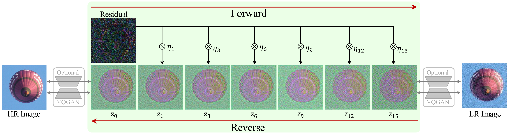

# 4D Imaging Radar Super-Resolution via Stereo-Camera-Guided Diffusion Models (4D Imaging Radar Bootcamp, Grand Award) 

[Shinhye Han](https://gkstlsgp3as.github.io/), [Hyok-been Lee], [Hwisong Kim], [Doyoung Lee], [Duk-jin Kim]

---
>As demand for high-performance sensors rises with autonomous systems, 4D Imaging Radar has gained attention for its cost-effective and reliable performance in adverse weather, capable of 3D object recognition and speed tracking using MIMO technology. While useful in various fields, including fall detection and surveillance, 4D Radar faces limitations due to its low spatial resolution compared to LiDAR, which provides finer 3D details. 4D Radar's reliance on longer radio wavelengths results in coarser data, often missing static object details.
To address these issues, two enhancement techniques—super-resolution and inpainting—are used to improve radar data quality. Super-resolution increases image resolution, and inpainting fills in missing data, enhancing radar-generated point clouds. Radar data processing methods fall into three types: voxel-based, point cloud-based, and range image-based, with the last offering computational efficiency by converting 3D data into 2D images. The research employs stereo cameras to guide data enhancement with a diffusion-based model, ResShift, achieving high-fidelity, high-resolution point clouds for more precise downstream applications.>

## Requirements
* Python 3.10, Pytorch 2.1.2, [xformers](https://github.com/facebookresearch/xformers) 0.0.23
* More detail (See [environment.yml](environment.yml))
A suitable [conda](https://conda.io/) environment named `resshift` can be created and activated with:

```
conda create -n resshift python=3.10
conda activate resshift
conda install pytorch==2.1.1 torchvision==0.16.1 torchaudio==2.1.1 pytorch-cuda=12.1 -c pytorch -c nvidia
pip install -r requirements_4dsr.txt
```
or
```
conda env create -f environment.yml
conda activate resshift
```
<!--
### :point_right:
https://github.com/user-attachments/assets/c8e791b5-eea6-4c63-93f2-42f7bdd82100

### :airplane: Training
```
CUDA_VISIBLE_DEVICES=0,1,2,3 torchrun --standalone --nproc_per_node=4 --nnodes=1 main.py --cfg_path configs/inpaint_lama256_retina.yaml --save_dir ../results/
```

#### :rocket: Inference 
Reproduce the results for 4D Imaging Radar Super-Resolution:
```
# generate masks
python ./utils/generate_mask.py -i ../data/sample_retina/ -o ../data/sample_retina_mask/

# inpaint
python -m torch.distributed.launch --nproc_per_node 1 inference_resshift_4dsr.py -i ../data/sample_retina/ -o ../results/inpaint/ --mask_path ../data/sample_retina_mask/ --task inpaint_retina --scale 1

# resize 
python ./utils/resize.py -i ../results/inpaint -o ../results/inpaint_resize

# super-resolution
python -m torch.distributed.launch --nproc_per_node 1 inference_resshift_4dsr.py -i ../results/inpaint_resize -o ../results/sr/ --task retinasr --scale 4

# unnormalize 
python ./utils/unnormalize.py -i ../results/inpaint -o ../results/inpaint_unnorm
```

### Contact
If you have any questions, please feel free to contact me via `sienna.shhan@gmail.com`.
